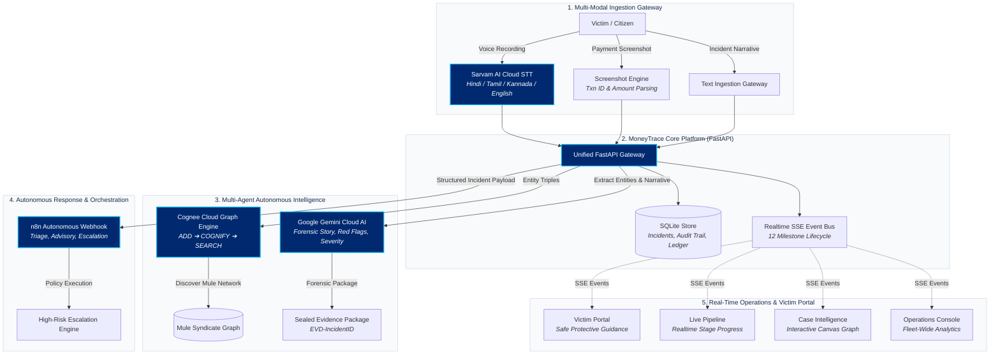
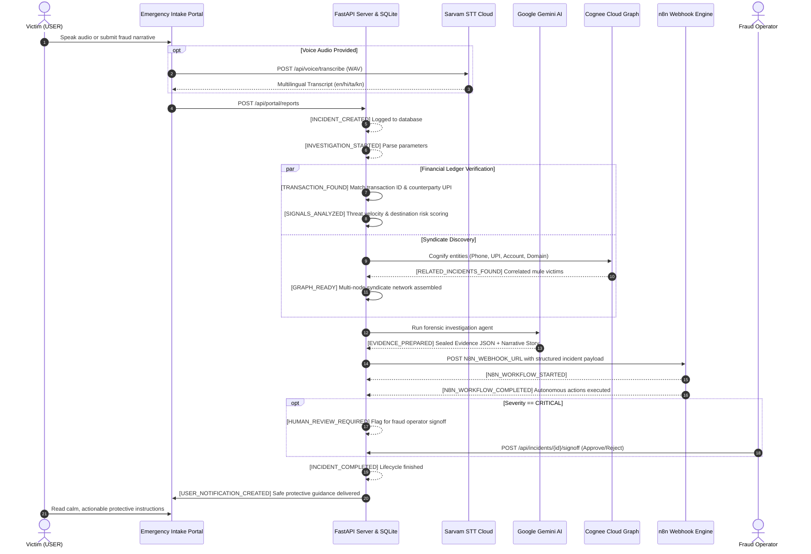
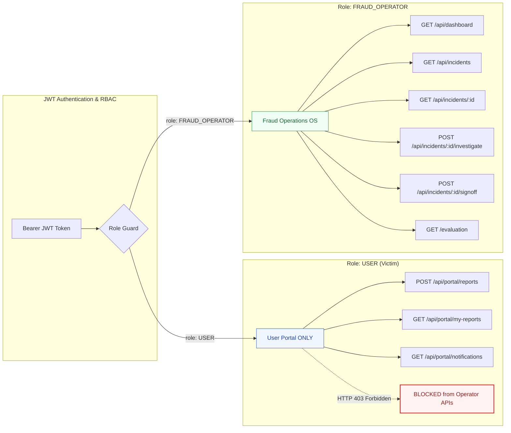

# MoneyTrace — Autonomous Financial Emergency Response

[](https://github.com/hannielvinu/MoneyTrace)
[](https://moneytrace-gv84.onrender.com)
[](https://www.python.org/)
[](https://fastapi.tiangolo.com/)
[](https://deepmind.google/technologies/gemini/)
[](https://www.sarvam.ai/)
[](https://www.cognee.ai/)
[](https://n8n.io/)

> **MoneyTrace turns a victim's first report into an autonomous financial emergency response for payment fraud and cyber financial crimes.**  
> Built for the **Paytm Build for India AI Hackathon — Autonomous AI Teammates track**.

---

## 📑 Table of Contents
- [The Problem](#-the-problem)
- [System Architecture](#-system-architecture)
- [End-to-End Investigation Lifecycle Flow](#-end-to-end-investigation-lifecycle-flow)
- [Data Isolation & Security Model](#-data-isolation--security-model)
- [Empirical Verification & Accuracy Benchmark](#-empirical-verification--accuracy-benchmark)
- [Core Integrations](#-core-integrations)
- [Role-Based Application Views](#-role-based-application-views)
- [Demo Credentials](#-demo-credentials)
- [Local Development Setup](#-local-development-setup)
- [Production Deployment](#-production-deployment)
- [Automated Verification Tests](#-automated-verification-tests)

---

## 💡 The Problem

When cyber financial fraud strikes, victims face critical distress:
> *"My money is gone. Who do I call? What do I do right now?"*

Traditional fraud management systems suffer from:
1. **The Critical Golden Hour Gap**: Funds hop across synthetic UPI handles, mule accounts, and crypto off-ramps within minutes while victims are stuck filling static complaint forms.
2. **Siloed Intelligence**: Banks and payment apps investigate incidents in isolation, failing to correlate interconnected scammer infrastructure across victims.
3. **No Immediate Protective Guidance**: Victims receive generic ticket numbers rather than actionable, calm, step-by-step advisories to freeze compromised accounts and stop recurring debits.

**MoneyTrace operates as an autonomous financial emergency teammate** that ingests multi-modal reports, isolates mule rings, reasons over financial evidence, triggers automated defensive workflows, and guides victims in real time.

---

## 🏛️ System Architecture



---

## 🔄 End-to-End Investigation Lifecycle Flow

The MoneyTrace persistent event bus orchestrates and records an immutable 12-stage investigation timeline:



---

## 🛡️ Data Isolation & Security Model

MoneyTrace enforces strict multi-tenant role isolation at the HTTP middleware and database layer:



---

## 🔬 Empirical Verification & Accuracy Benchmark

To evaluate MoneyTrace's accuracy, a canonical evaluation system runs on a **Held-Out Blind Test Partition (Seed 42, 2,000 Records)**:

### 1. Multi-Class Classification (7 Discrete Categories)
| Benchmark Metric | Score | Industry Interpretation |
|---|---|---|
| **Macro F1 (Unweighted)** | **87.37%** | Balanced harmonic performance across all classes |
| **Overall Accuracy** | **86.50%** | Exact categorization rate on blind test cases |
| **Weighted F1** | **86.57%** | Volume-adjusted performance |
| **Macro Precision** | **88.88%** | Low false-accusation rate across all classes |
| **Macro Recall** | **86.58%** | High capture rate of actual fraud classes |

#### Per-Class Performance Breakdown (400 Out-of-Sample Test Cases)
| Class | Precision | Recall | F1-Score | Support | True Positives |
|---|---|---|---|---|---|
| **LEGITIMATE** | 77.89% | 88.10% | **82.68%** | 84 | 74 / 84 |
| **UPI_FRAUD** | 84.88% | 93.59% | **89.02%** | 78 | 73 / 78 |
| **PHISHING** | 88.52% | 80.60% | **84.38%** | 67 | 54 / 67 |
| **IMPERSONATION** | 91.30% | 79.25% | **84.85%** | 53 | 42 / 53 |
| **INVESTMENT_FRAUD** | 100.00% | 81.25% | **89.66%** | 48 | 39 / 48 |
| **ACCOUNT_TAKEOVER** | 79.55% | 89.74% | **84.34%** | 39 | 35 / 39 |
| **WRONG_TRANSFER** | 100.00% | 93.55% | **96.67%** | 31 | 29 / 31 |

### 2. Binary Fraud Detection (Malicious vs Non-Malicious)
```
  Total Test Instances: 400
  ┌──────────────────────────────────────────────┐
  │  Metric               Value                  │
  ├──────────────────────────────────────────────┤
  │  Fraud F1-Score       94.83%                 │
  │  Accuracy             92.75%                 │
  │  Precision            96.38%  (TP: 266)      │
  │  Recall               93.33%  (FN: 19)       │
  │  False Positive Rate   8.70%  (FP: 10)       │
  │  False Negative Rate   6.67%                 │
  └──────────────────────────────────────────────┘
```

### 3. Rigorous Anti-Leakage Controls
- **Target Insulation**: Models and inference functions never receive `fraud_class` or `is_fraud` ground truth.
- **Overlapping Distributions**: Legitimate transactions and fraud categories share overlapping amount distributions (₹150 to ₹45,000) and channel profiles.
- **Cryptographic Provenance**: Canonical dataset SHA-256 hash: `cdef60222fe47f2ff8569233ec8b02083d5844d5d42a4a1dfcc7de9f652cb6e9`.
- **Reproducibility**: Run `python evaluation/generate_dataset.py && python evaluation/evaluator.py`.

---

## ⚡ Core Integrations

1. **Sarvam AI Cloud STT (`SARVAM_API_KEY`)**:
   - In-browser microphone audio capture with Web Audio API.
   - Real-time STT supporting English, Hindi (हिन्दी), Tamil (தமிழ்), and Kannada (ಕನ್ನಡ).
2. **Google Gemini Cloud AI (`LLM_API_KEY`)**:
   - Multi-modal reasoning over narrative, transactions, and syndicate relationships.
   - Extracts red flags, determines severity, and generates forensic evidence summaries.
3. **Cognee Cloud (`COGNEE_API_KEY`, `COGNEE_BASE_URL`)**:
   - Semantic knowledge graph linking shared counterparties across victims.
   - Emits `RELATED_INCIDENTS_FOUND` and powers the interactive canvas graph.
4. **n8n Workflow Automation (`N8N_WEBHOOK_URL`)**:
   - Webhook trigger on new incidents with structured validation.
   - Escalates high-risk cases and executes automated containment policies.
5. **Real-Time Server-Sent Events (SSE)**:
   - Pub/sub event bus streaming 12 distinct milestones to all connected operator and victim views.

---

## 🖥️ Role-Based Application Views

| View | Route | Role | Highlights |
|---|---|---|---|
| **Victim Emergency Intake** | `/portal` | `USER` | Multilingual microphone recording, OCR upload, immediate case reference, user-safe guidance. |
| **Live Investigation Pipeline** | `/investigations` | `FRAUD_OPERATOR` | Realtime stage progress bars, active node pulsing, live telemetry feed with auto-dimming highlights, and similarity alerts. |
| **Case Intelligence Workspace** | `/cases/:id` | `FRAUD_OPERATOR` | Interactive Canvas graph, evidence JSON inspector, linked victim timeline, human-in-the-loop signoff. |
| **Command Console** | `/dashboard` | `FRAUD_OPERATOR` | Fleet-wide analytics, exposure metrics, active intake feed updating dynamically via SSE. |
| **Accuracy Benchmark** | `/evaluation` | `FRAUD_OPERATOR` | Live evaluation dashboard showing multi-class matrices, binary accuracy, per-class F1, and methodology audit. |

---

## 🔑 Demo Credentials

| Role | Email | Password | Allowed Access |
|---|---|---|---|
| **USER (Victim 1)** | `victim@moneytrace.in` | `victim123` | Access `/portal` only (isolated personal reports). |
| **USER (Victim 2)** | `victim2@moneytrace.in` | `victim123` | Access `/portal` only (validates tenant isolation). |
| **FRAUD_OPERATOR** | `operator@moneytrace.in` | `operator123` | Full access to `/investigations`, `/cases/:id`, `/dashboard`, `/evaluation`. |

---

## 🚀 Local Development Setup

### 1. Clone Repository
```bash
git clone https://github.com/hannielvinu/MoneyTrace.git
cd MoneyTrace/backend
```

### 2. Install Dependencies
```bash
pip install -r requirements.txt
```

### 3. Configure Environment Variables
Create a `.env` file inside `backend/` (refer to `.env.example`):
```env
LLM_API_KEY=your_gemini_api_key
SARVAM_API_KEY=your_sarvam_api_key
COGNEE_API_KEY=your_cognee_api_key
COGNEE_BASE_URL=https://api.cognee.ai
N8N_WEBHOOK_URL=https://your-n8n-instance.com/webhook/moneytrace-incident
JWT_SECRET=moneytrace-secure-jwt-secret-key-2026
PORT=8000
```

### 4. Initialize Database
```bash
python -c "from moneytrace.db.database import init_db; init_db(force_reseed=True)"
```

### 5. Start Server
```bash
python -m uvicorn moneytrace.main:app --host 127.0.0.1 --port 8000
```
Visit: `http://127.0.0.1:8000`

---

## 🌐 Production Deployment (Render)

MoneyTrace includes a pre-configured [render.yaml](file:///c:/Users/dragn/OneDrive/Desktop/Resume%20Projects/MoneyTrace/render.yaml) and [Dockerfile](file:///c:/Users/dragn/OneDrive/Desktop/Resume%20Projects/MoneyTrace/Dockerfile) for one-click deployment:

1. Connect your repository on [dashboard.render.com](https://dashboard.render.com/).
2. Create a new **Web Service** with:
   - **Runtime**: `Python 3`
   - **Build Command**: `cd backend && pip install -r requirements.txt`
   - **Start Command**: `cd backend && python -m uvicorn moneytrace.main:app --host 0.0.0.0 --port $PORT`
3. Add your environment variables (`JWT_SECRET`, `LLM_API_KEY`, `SARVAM_API_KEY`, `COGNEE_API_KEY`, `N8N_WEBHOOK_URL`).
4. Deploy to receive your permanent live URL (e.g. `https://<your-service-name>.onrender.com`).

---

## 🧪 Automated Verification Tests

Run the full end-to-end verification suite:
```bash
python -X utf8 test_acceptance.py
```

Validates:
- Health check & API routes
- Tenant data isolation (USER vs FRAUD_OPERATOR HTTP 403 enforcement)
- Sarvam Cloud AI voice transcription
- Gemini Cloud AI investigation & structured story generation
- Cognee syndicate correlation & graph discovery
- n8n autonomous webhook dispatch & execution
- Complete 12-milestone persistent event bus lifecycle

---

## 👥 Team & Hackathon Submission

- **Repository**: [https://github.com/hannielvinu/MoneyTrace.git](https://github.com/hannielvinu/MoneyTrace.git)
- **Track**: Paytm Build for India AI Hackathon — Autonomous AI Teammates
- **Author**: [@hannielvinu](https://github.com/hannielvinu)
